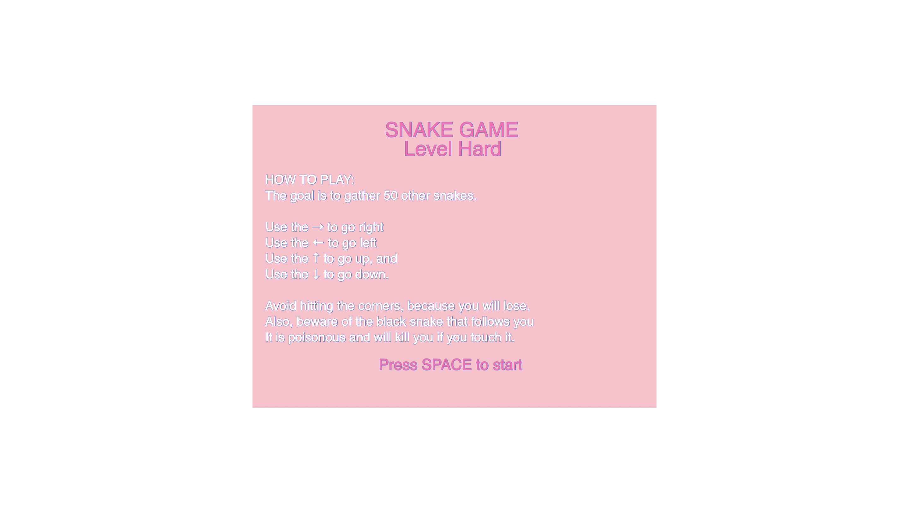
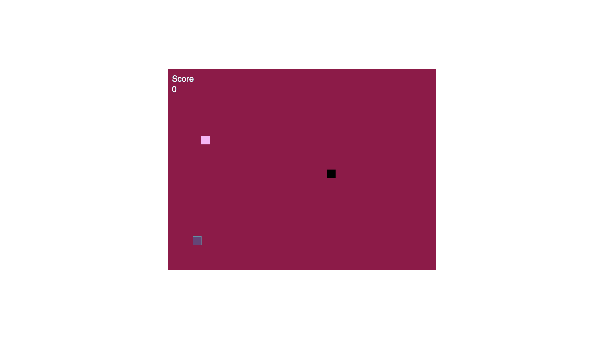

# Variation Jam - Snake Game, hard level

Nerly Cadet

[View this project online]( https://nerlylli.github.io/cart253/topics/topics/variation-jam/hard-variation)

## Description

This description should help the reader understand what the program is, anything they should know to be able to experience it (controls, special features, etc.), and what the desired user experience is. For example:

> This is the hard version of my snake game.
> In the game, you are a small snake, and you need to grow.
> The goal is to gather up 50 other snakes to win.
> The only obstacles present are
    > touching the corners will make the player lose the game. 
    > touching the black snake will make the player lose the game.
        > the black snake is following the player snake
        > the black snake's position changes everytime the food is eaten.

## Screenshot(s)

This bit should have some images of the program running so that the reader has a sense of what it looks like. For example:

> 
>  - it looks similar to the medium version, but the black snake is moving. 

## Attribution

This bit should attribute any code, assets or other elements used taken from other sources. For example:

> - This project uses [p5.js](https://p5js.org).
> - The clown image is a capture of the clown from the Apple emoji character set.
> - This project was isnpired by p5 Snake Game by Viv-Galinari (https://editor.p5js.org/Viv-Galinari/sketches/H1FqlMT5Z)
> - The barking sound effect is "single dog bark 1" by crazymonke9 from freesound.org: https://freesound.org/people/crazymonke9/sounds/418107/

## License

This bit should include the license you want to apply to your work. For example:

> This project is licensed under a Creative Commons Attribution ([CC BY 4.0](https://creativecommons.org/licenses/by/4.0/deed.en)) license with the exception of libraries and other components with their own licenses.